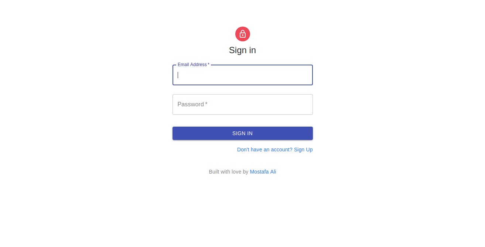
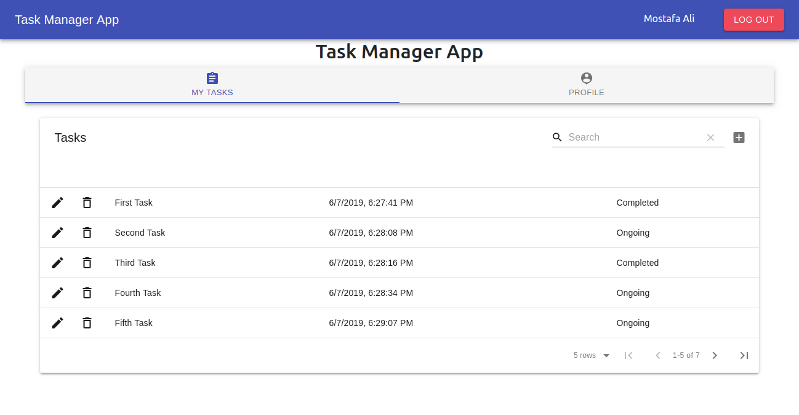
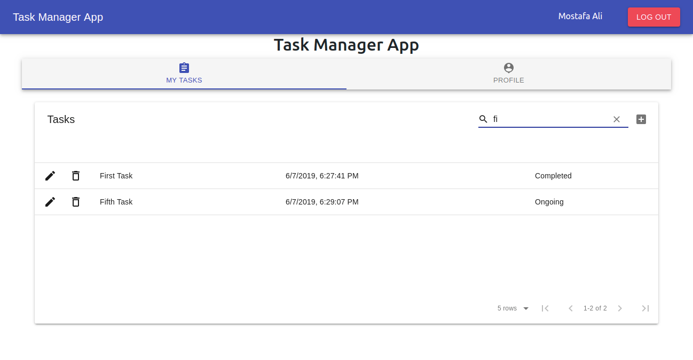
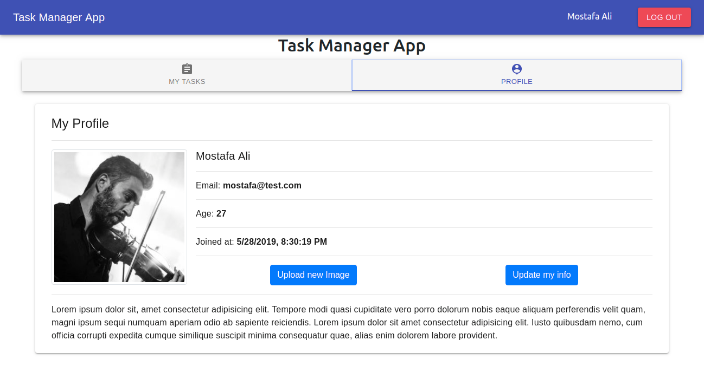

# task-manager-app
#### A simple task manager app handles all CRUD opeartions on tasks (create, view, update and delete) and user profile info (update and add user image). 
##### with all authentication and authorization handled in the backend using `Node.js` (JWT, Validation, Sanitization)
##### a friendly frontend app using `React.js` (Routing, Context API, React hooks, MaterialUI)

> ###### First time configurations
- `git clone https://github.com/mostafa3li/task-manager-app.git`
- `cd task-manager-app/ && npm install`
- `touch .env`
**==> add the following environment variables:**
    - PORT=5000 **(5000 is an example)**
    - MONGODB_URL=mongodb://localhost:27017/task-manager-api
    - JWT_SECRET=secret **(secret is an example)**
- `cd client/ && npm install`
- `touch .env`
**==> add the following environment variables:**
    - REACT_APP_BASE_URL=http://localhost:5000      **(the same port 5000 as used above)**
- `cd .. && npm run dev`

> ###### Running development server Everytime 
- `cd task-manager-app/ && npm run dev`

## Sign in

## add & edit & delete & view a Task

## search for a Task

## view profile & update info & update image

